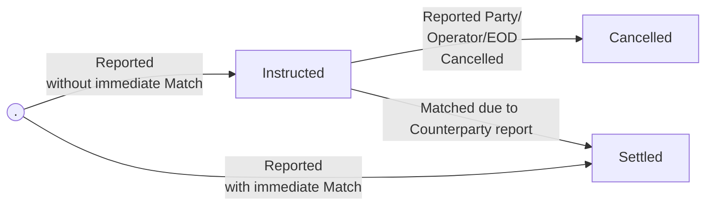

# Alleged Transfers

* Alleged Transfers allows counter parties of a transfer to report them to the exchange.&#x20;
* Upon matching the alleged transfer details, system settles the transfer between the counterparties.&#x20;
* Alleged Transfers can be created by both MP and Trader




## createAllegedTransfer

This API allows creating alleged transfers


qualifier: v1/exchange.ledger/createAllegedTransfer


### Request

<table><thead><tr><th width="175">Parameter</th><th width="115.33333333333331">Type</th><th>Description</th></tr></thead><tbody><tr><td>type</td><td>eNum</td><td><p>Transfer Type<br></p><p>Allowed values:</p><p>- DvP</p><p>- RvP</p><p>- FoP</p><p>- FoP_Receive</p><p>- DvD</p></td></tr><tr><td>ledgerAccountId</td><td>Int</td><td>Ledger Account Id of the reporting MP</td></tr><tr><td>sendingAssets <code>optional</code></td><td>[ ] Asset Objects</td><td><p>An array of Asset Objects (see the separate table below for more details)</p><p>The sending asset to the counterparty</p></td></tr><tr><td>receivingAssets <code>optional</code></td><td>[ ] Asset Objects</td><td><p>An array of Asset Objects (see the separate table below for more details)</p><p>The receiving Asset from the counterparty</p></td></tr><tr><td>externalId</td><td> String</td><td><p>External Id</p><p>Values can’t be reused for the same MP when another Instructed Alleged Transfer exists</p></td></tr></tbody></table>

#### Asset Object

<table><thead><tr><th width="175">Parameter</th><th width="115.33333333333331">Type</th><th>Description</th></tr></thead><tbody><tr><td>assetId</td><td>Int</td><td>Asset Id</td></tr><tr><td>amount</td><td>Decimal</td><td>Amount of the asset in transaction units</td></tr></tbody></table>

### **Response**

<table><thead><tr><th width="175.51654052734375">Parameter</th><th width="107.58418782552081">Type</th><th>Description</th></tr></thead><tbody><tr><td>allegedTransferId</td><td>Int</td><td><p>Alleged Transfer Id</p><p>Unique is generated by the system for the alleged transfer</p></td></tr><tr><td>status</td><td>String</td><td>Instructed</td></tr></tbody></table>

### **Error Codes**

<table><thead><tr><th width="128">Code</th><th>Message</th></tr></thead><tbody><tr><td>1</td><td><code>Exchange is unavailable</code></td></tr><tr><td>102</td><td><p><code>Trading is not allowed</code></p><p><code>Not allowed</code></p></td></tr><tr><td>1000</td><td><code>Missing or invalid parameter: [FieldName]</code></td></tr><tr><td>1002</td><td><code>externalId is already in use</code></td></tr><tr><td>1007</td><td><code>Invalid session</code></td></tr><tr><td>1008</td><td><code>Insufficient permissions</code></td></tr><tr><td>1010</td><td><code>counterpartyMpId not found</code></td></tr><tr><td>1012</td><td><code>Minimum amount for [assetName] is [Asset.minTransfer]</code></td></tr><tr><td>1014</td><td><code>Amount of [assetName] should be an increment of [transferIncrement]</code></td></tr><tr><td>1020</td><td><code>Unsupported counterparty</code><br><code>Both sides can’t have the same ledgerAccountId</code></td></tr><tr><td>1032</td><td> <code>Account not found</code></td></tr><tr><td>2000</td><td><code>Insufficient balance: [Amt] [TransactionUnits] of [AssetName] are missing</code></td></tr></tbody></table>

### **Samples**



```json
{
  "q": "v1/exchange.ledger/createAllegedTransfer",
  "sid": 55,
  "d": {
    "type": "DvD",
    "externalId": "12341353",
    "counterpartyMpId": "9",
    "sendingAssets": [
      {
        "assetId": "10",
        "amount": "1"
      }
    ],
    "receivingAssets": [
      {
        "assetId": "97",
        "amount": "1000000"
      },
      {
        "assetId": "44",
        "amount": "100000"
      }
    ],
    "ledgerAccountId": "36"
  }
}

```



```json
{
  "q": "v1/exchange.ledger/createAllegedTransfer",
  "sid": 55,
  "d": {
    "allegedTransferId": "311",
    "status": "Instructed"
  }
}
```



```json
{
  "sig": 2,
  "q": "v1/exchange.ledger/createAllegedTransfer",
  "errorType": "500",
  "sid": 1,
  "d": {
    "errorCode": 1008,
    "errorMessage": "Insufficient permissions"
  }
}
```




## cancelAllegedTransfer

This API allows cancellation of alleged transfers


qualifier: v1/exchange.ledger/cancelAllegedTransfer


### Request

<table><thead><tr><th width="175">Parameter</th><th width="115.33333333333331">Type</th><th>Description</th></tr></thead><tbody><tr><td>allegedTransferId</td><td>Int</td><td>Alleged Transfer Id</td></tr></tbody></table>

### **Response**

No response body

### **Error Codes**

<table><thead><tr><th width="128">Code</th><th>Message</th></tr></thead><tbody><tr><td>1</td><td><code>Exchange is unavailable</code></td></tr><tr><td>100</td><td><code>Missing or invalid parameter: [FieldName]</code></td></tr><tr><td>101</td><td><code>[FieldName] not found</code></td></tr><tr><td>102</td><td><code>Trading is not allowed</code></td></tr><tr><td>1007</td><td><code>Invalid session</code></td></tr><tr><td>1008</td><td><code>Insufficient permissions</code></td></tr><tr><td>1100</td><td><code>Alleged transfer not found</code></td></tr></tbody></table>

### **Samples**



```json
{
  "q": "v1/exchange.ledger/cancelAllegedTransfer",
  "sid": 57,
  "d": {
    "allegedTransferId": 311
  }
}
```



```json
{
  "sig": 1,
  "q": "v1/exchange.ledger/cancelAllegedTransfer",
  "sid": 57
}
```



```json
{
  "sig": 2,
  "q": "v1/exchange.ledger/cancelAllegedTransfer",
  "errorType": "500",
  "sid": 1,
  "d": {
    "errorCode": 1008,
    "errorMessage": "Insufficient permissions"
  }
}
```



