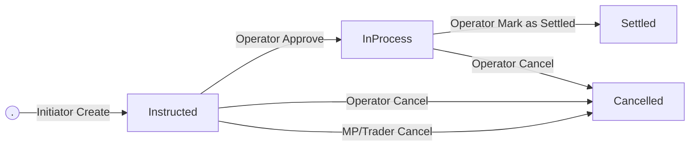

# Transaction Requests

* Transaction Requests allows to capture deposits and withdrawals with the below workflow.
* Transaction Requests can be created by both MP and Trader



## createTransactionRequest

This API is used to create a new Transaction Requests.&#x20;


qualifier: v1/exchange.ledger/createTransactionRequest


### Request

<table><thead><tr><th width="175">Parameter</th><th width="115.33333333333331">Type</th><th>Description</th></tr></thead><tbody><tr><td>type</td><td>eNum</td><td><p>Transaction Type<br></p><p>Allowed values:</p><p>- Deposit<br>- Withdrawal</p></td></tr><tr><td>ledgerAccountId</td><td>Int</td><td>Ledger Account </td></tr><tr><td>assetId</td><td>Int</td><td>Asset </td></tr><tr><td>amount</td><td>Decimal</td><td>Transaction amount</td></tr><tr><td>description <code>optional</code></td><td>String</td><td>Description</td></tr><tr><td>instructionDetailsId <code>optional</code></td><td>uuid</td><td>Instruction Details attachment id<br> <a data-mention href="transaction-requests.md#upload-transaction-details">#upload-transaction-details</a><br>Conditionally required/not allowed see below for details</td></tr><tr><td>assetDetailsId <code>optional</code></td><td>uuid</td><td>Asset Details attachment id<br> <a data-mention href="transaction-requests.md#upload-transaction-details">#upload-transaction-details</a><br>Conditionally required/not allowed see below for details</td></tr></tbody></table>

#### instructionDetailsId / assetDetailsId

<table><thead><tr><th width="123.37890625">Asset Type</th><th width="217.31795247395831">Transaction Request Type</th><th>instructionDetailsId</th><th>assetDetailsId</th></tr></thead><tbody><tr><td>Cash</td><td>Deposit</td><td>Optional</td><td>Not allowed</td></tr><tr><td>Cash</td><td>Withdrawal</td><td>Not allowed</td><td>Not allowed</td></tr><tr><td>!= Cash</td><td>Deposit</td><td>Required</td><td>Required</td></tr><tr><td>!= Cash</td><td>Withdrawal</td><td>Required</td><td>Not allowed</td></tr></tbody></table>

### **Response**

<table><thead><tr><th width="174.88887532552081">Parameter</th><th width="139.3333740234375">Type</th><th width="303.7777506510417">Description</th></tr></thead><tbody><tr><td>id</td><td>Int</td><td>Transaction request id, system generated</td></tr><tr><td>status</td><td>String</td><td>"Instructed"</td></tr></tbody></table>


### **Error Codes**

<table><thead><tr><th width="128">Code</th><th>Message</th></tr></thead><tbody><tr><td>1</td><td><code>Exchange is unavailable</code></td></tr><tr><td>100</td><td><code>Missing or invalid parameter: [FieldName]</code></td></tr><tr><td>1007</td><td><code>Invalid session</code></td></tr><tr><td>1008</td><td><code>Insufficient permissions</code></td></tr><tr><td>1032</td><td><code>Ledger Account not found</code></td></tr></tbody></table>

### **Samples**



```json
{
  "q": "v1/exchange.ledger/createTransactionRequest",
  "sid": 54,
  "d": {
    "amount": "1",
    "type": "Deposit",
    "assetId": "10",
    "instructionDetailsId": "2eb83b2f-1118-4ecf-87ee-b18d639ff07f",
    "assetDetailsId": "080f8c19-55e6-42fe-a211-735425f17adb",
    "ledgerAccountId": "36"
  }
}

```



```json
{
  "q": "v1/exchange.ledger/createTransactionRequest",
  "sid": 54,
  "d": {
    "id": "438",
    "status": "Instructed"
  }
}
```



```json
{
  "sig": 2,
  "q": "v1/exchange.ledger/createTransactionRequest",
  "errorType": "500",
  "sid": 1,
  "d": {
    "errorCode": 1008,
    "errorMessage": "Insufficient permissions"
  }
}
```




## cancelTransactionRequest

This API is used to cancel existing Transaction Requests. Cancellations can be done only when they are in Instructed status.


qualifier: v1/exchange.ledger/cancelTransactionRequest


### Request

<table><thead><tr><th width="175">Parameter</th><th width="115.33333333333331">Type</th><th>Description</th></tr></thead><tbody><tr><td>id</td><td>Int</td><td>Transaction request Id</td></tr></tbody></table>

### **Response**

No response body

### **Error Codes**

<table><thead><tr><th width="128">Code</th><th>Message</th></tr></thead><tbody><tr><td>1</td><td><code>Exchange is unavailable</code></td></tr><tr><td>100</td><td><code>Missing or invalid parameter: [FieldName]</code></td></tr><tr><td>101</td><td><code>Transaction Request not found</code></td></tr><tr><td>1007</td><td><code>Invalid session</code></td></tr><tr><td>1008</td><td><code>Insufficient permissions</code></td></tr><tr><td>1032</td><td><code>Transaction Request not found</code></td></tr></tbody></table>

### **Samples**



```json
{
  "q": "v1/exchange.ledger/cancelTransactionRequest",
  "sid": 56,
  "d": {
    "id": 440
  }
}
```



```json
{
  "sig": 1,
  "q": "v1/exchange.ledger/cancelTransactionRequest",
  "sid": 56
}
```



```json
{
  "sig": 2,
  "q": "v1/exchange.ledger/cancelTransactionRequest",
  "errorType": "500",
  "sid": 1,
  "d": {
    "errorCode": 1008,
    "errorMessage": "Insufficient permissions"
  }
}
```



## REST API Authentication&#x20;

Uploading and retrieving files from the system is performed via REST API.

Similar to the `createSession` API, authentication for this REST API can be done using one of the following methods:

* Trader authentication using an Auth0 bearer token
* MP / MP Group authentication using a digital signature as bearer token&#x20;

When authenticating as an MP, the bearer token must be generated in the following format:

```
apiKey|<base64(<apiKey>|<signature>|<epoch_timestamp>)>
```

Note&#x73;**:**

* The Base64-encoded value must be URL-safe
* Signature specification is defined in `createSession` API&#x20;

#### **Samples**




```bash
apiKey|ZWU2OTI1MGQtNzk3Yi00MDFjLTgyMGItMDQzNjAyNzEyYmIzfDJlMTJkNDhjZTRhMDczYTY4NmNiMjE4ZTMyOTM4YmY3MzZmYWZiZTkzYzBlYWM0NTg4MWU0ODkyYzY3NzVkZWJ8MTc3MTM5OTYzMzc4NQ
```




## uploadTransactionDetails

This API allows to upload a files and get a uuids to attach in create transaction requests.

Note: This is a REST API&#x20;


\[POST] {Participants Ledger REST}/v1/exchange.ledger/uploadTransactionDetails


### Request

Upload the file using a multipart/form-data POST request.

Allowed filetypes: CSV, TXT, PDF, XLSX/XLS, DOCX/DOC, JPG, JPEG, PNG

### **Response**

<table><thead><tr><th width="186.0869140625">Parameter</th><th width="101.73030598958331">Type</th><th>Description</th></tr></thead><tbody><tr><td>transactionDetailsId</td><td>uuid</td><td>System generated Transaction Details Id</td></tr></tbody></table>

### **Error Codes**

<table><thead><tr><th width="128">Code</th><th>Message</th></tr></thead><tbody><tr><td>1</td><td><code>Exchange is unavailable</code></td></tr><tr><td>100</td><td><code>Missing or invalid parameter: [FieldName]</code><br><code>File is empty</code><br><code>File size should be less than 10 MB</code><br><code>Allowed file types: [list]</code><br><code>Transaction details upload is not allowed</code></td></tr></tbody></table>


### **Samples**



```bash
curl --location 'https://api-gateway-master.rnd.exberry-rnd.io/v1/exchange.ledger/uploadTransactionDetails' \
--header 'Authorization: Bearer ••••••' \
--form 'file=@"/CD/file1.csv"'
```



```json
{
    "transactionDetailsId": "b986b2c6-1d9d-422b-b772-e70bca20d712"
}
```




## getTransactionDetailsUrl

This API allows users to get links to download the file uploaded using uploadTransactionDetails by providing their uuids.

Note: This is a REST API


\[POST] {Participants Ledger REST}/v1/exchange.ledger/getTransactionDetailsUrl


### Request

<table><thead><tr><th width="186.0869140625">Parameter</th><th width="101.73030598958331">Type</th><th>Description</th></tr></thead><tbody><tr><td>transactionDetailsId</td><td>uuid</td><td>Transaction Details Id of the file</td></tr></tbody></table>

### **Response**

<table><thead><tr><th width="186.0869140625">Parameter</th><th width="101.73030598958331">Type</th><th>Description</th></tr></thead><tbody><tr><td>transactionDetailsUrl</td><td>String</td><td>URL to download the file</td></tr></tbody></table>

### **Error Codes**

<table><thead><tr><th width="128">Code</th><th>Message</th></tr></thead><tbody><tr><td>1</td><td><code>Exchange is unavailable</code></td></tr><tr><td>100</td><td><code>Missing or invalid parameter: [FieldName]</code></td></tr></tbody></table>

### **Samples**



```bash
curl --location 'https://api-gateway-master.rnd.exberry-rnd.io/v1/exchange.ledger/getTransactionDetailsUrl' \
--header 'Content-Type: application/json' \
--header 'Authorization: ••••••' \
--data '{
    "transactionDetailsId": "a92fa0a1-dd0a-408d-a253-06607c1016a2"
}'
```




```json
{
  "transactionDetailsUrl": "https://ledger-rnd-eks-986229572228.s3.eu-west-2.amazonaws.com/ops395/8/a92fa0a1-dd0a-408d-a253-06607c1016a2?response-content-disposition=attachment%3B%20filename%3D%22alleged-transfers%20%281%29.csv%22&X-Amz-Security-Token=IQoJb3JpZ2la64d05640024b016066f7e1d"
}
```



