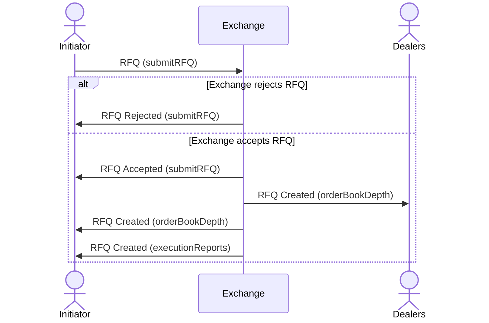
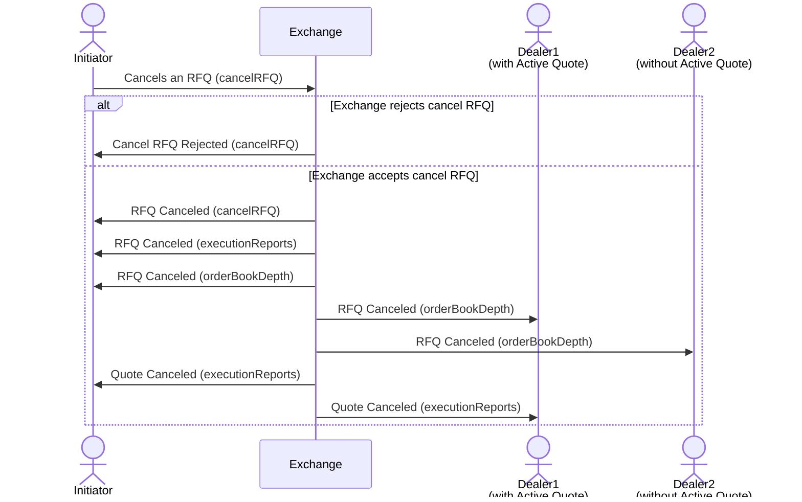
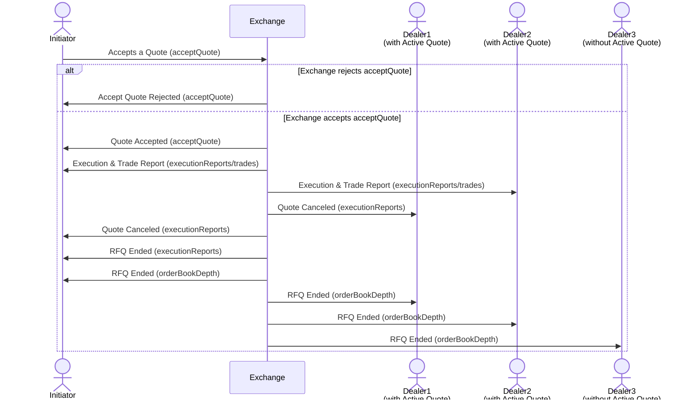
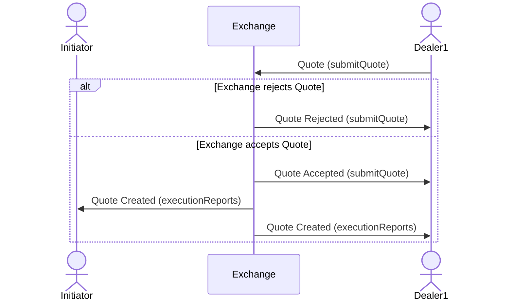
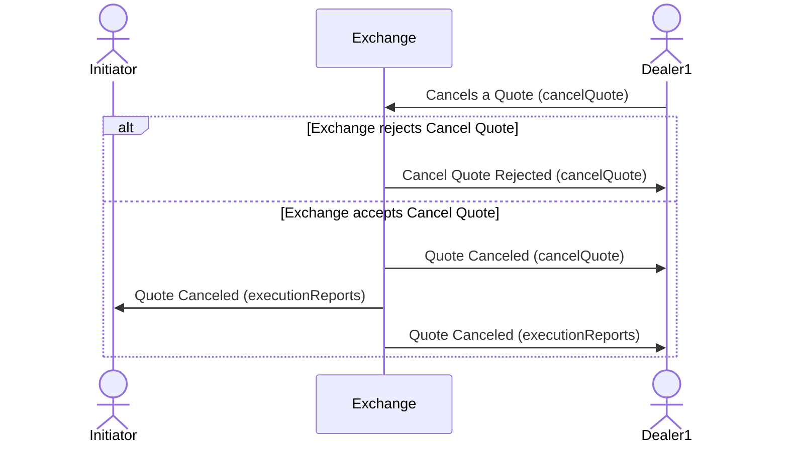
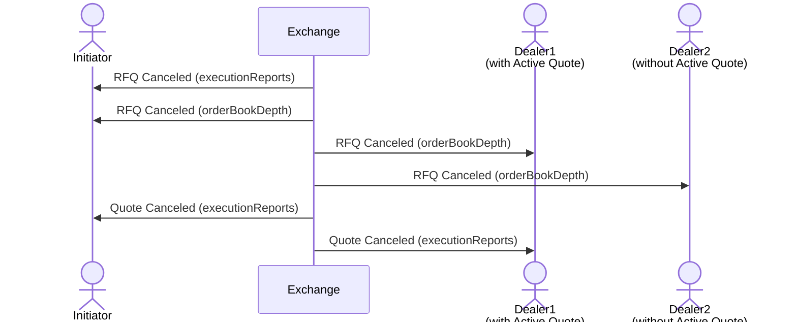

# Workflows

This section has all RFQ workflows supported by the excahnge.

## Initiator Workflows

### Initiator Creates an RFQ

1. The [submitRFQ](initiator-trading.md#submitrfq) API is used to create a new RFQ in the exchange.&#x20;
2. If the request is successful,&#x20;
   1. New RFQ is disseminated to all MPs via the orderBookDepth stream.
   2. In addition, initiator gets the New RFQ via executionReports stream.

### Initiator cancels an RFQ

1. The [cancelRFQ](initiator-trading.md#cancelrfq) API is used by the RFQ initiator to cancel an RFQ. The system automatically cancels all active Quotes related to an RFQ when it is cancelled.
2. If the request is successful,&#x20;
   1. Quote cancellations are disseminated to the initiator of the RFQ and dealers with active Quotes via executionReports stream.&#x20;
   2. All MPs get the RFQ cancellation via the orderBookDepth stream.&#x20;
   3. The initiator gets the RFQ cancellation via executionReports stream.

### Initiator accepts(hits/lifts) a Quote

1. The [acceptQuote](initiator-trading.md#acceptquote) API is used by the RFQ initiator to accept a Quote received.
2. If the request is successful,&#x20;
   1. Quote related quote executions are disseminated to the initiator of the RFQ and dealer of the Quote via the executionReports stream.&#x20;
   2. All active non executed quotes are cancelled by the system and disseminated to the initiator of the RFQ and dealer of the Quote via the executionReports stream.
   3. The related RFQ ends and is disseminated to all dealers via the orderBookDepth stream.
   4. Trade reports are disseminated to the initiator and dealer via the trades stream.

## Dealer workflows

### Dealer replies to an RFQ

1. The [submitQuote](dealer-trading.md#submitquote) API is used to respond to an RFQ by creating a new Quote in the exchange. Multiple Quotes can be created for a single RFQ.
2. If the request is successful: New Quotes are disseminated to the initiator of the RFQ and the dealer via executionReports stream.

### Dealer Cancels a Quote

1. The [cancelQuote](dealer-trading.md#cancelquote) API is used by the Quote dealer to cancel a Quote.&#x20;
2. If the request is successful, Cancellations are disseminated to the initiator of the RFQ and the dealer via executionReports stream.

## Other workflows

### RFQ expiration

1. When the current time = expireTime of an active RFQ, the exchange cancels the RFQ with all its active Quotes due to expiration.
2. RFQ cancellations are disseminated to all MPs via the orderBookDepth stream.&#x20;
3. Initiator receives the RFQ cancellation via the executionReports stream.&#x20;
4. Quote cancellations are disseminated to their dealers and initiator of the RFQ via executionReports stream.

