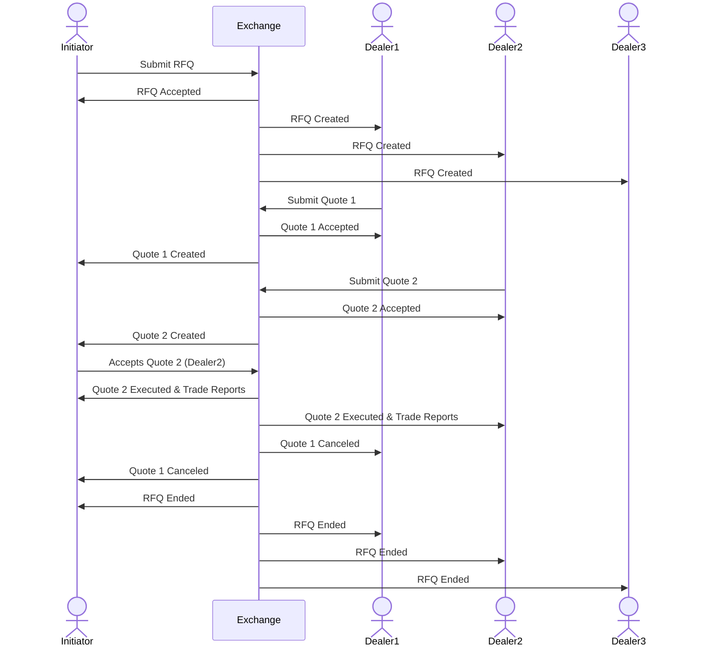

# Introduction

A trading model supported by the exchange where a Quote or Quotes are sent by dealers in response to a “Request for Quote(RFQ)” submitted by other initiators.\
Dealers/initiators can be any MPs or Traders of MPs.&#x20;

* All RFQ are public (The system currently doesn’t support private RFQs), have an expiration time after which the RFQ and all related Quotes get automatically cancelled by the system.&#x20;
* All Quotes are private, firm and executable.&#x20;
* The Quotes are executable exclusively by the party initiating the RFQ and the execution is triggered by initiator accepting a Quote.&#x20;

RFQ workflows supported by the system:

* Initiator creates an RFQ
* Dealer replies to an RFQ with Quotes
* Initiator accepts(hits/lifts) a Quote
* Dealer cancels a Quote
* Initiator cancels an RFQ
* RFQ expiration

**RFQ workflow diagram**

