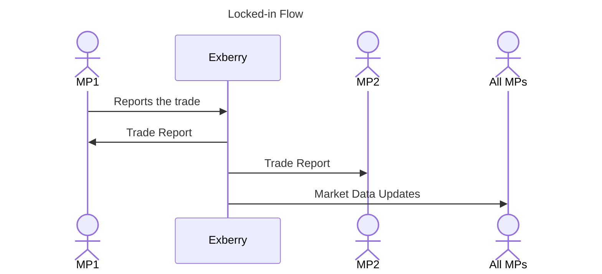
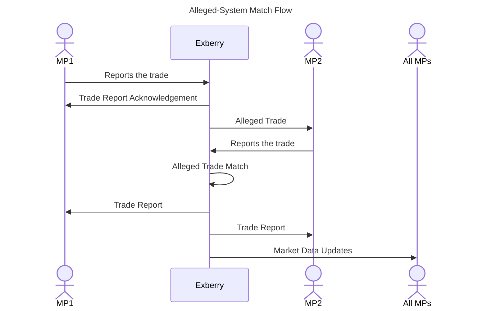
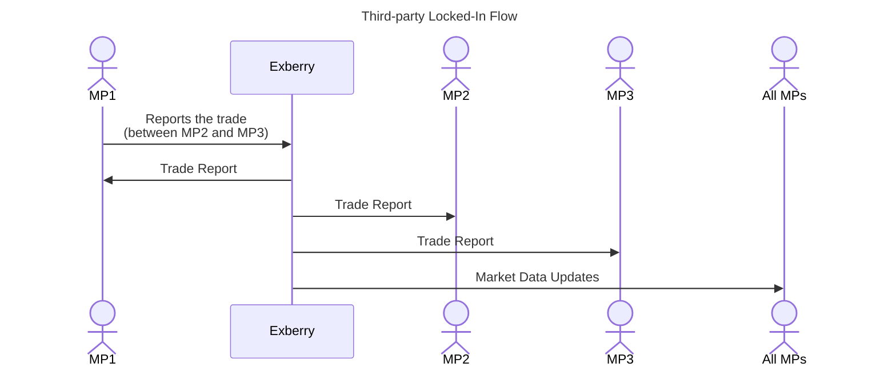

# Introduction

Market Participants can use these APIs to report their off-exchange trades into the exchange.&#x20;

The system supports below reporting workflows.

1. **Locked In** - one MP reports both sides of the trade. This can be used when MPs have pre-agreements with counterparty MPs to report trades as final without any counterparty involvement.&#x20;
2. **Alleged System Match** - both MPs report the trade. The trade becomes final if the system is able to match the terms of the trade. Following fields should be equally reported from both parties to match:
   * Instrument
   * Trade type
   * Price
   * Quantity
   * Buy MP&#x20;
   * Sell MP
   * External Trade Id
3. <mark style="color:blue;">(NEW v1.51.0)</mark> **Third-party reporting of Locked-In Trades** - The trade is reported by a Third-party MP(neither Buy side MP nor sell side MP). The state of the trade is final and requires no action from Buy side MP and sell side MP. System adds reporting mpId to both sides of the trade as below:
   * PartyIDSource(447) = P (Short code identifier)
   * PartyID(448) = \<mpId of the reporting MP>&#x20;
   * PartyRole(452) = 116(Reporting entity)

