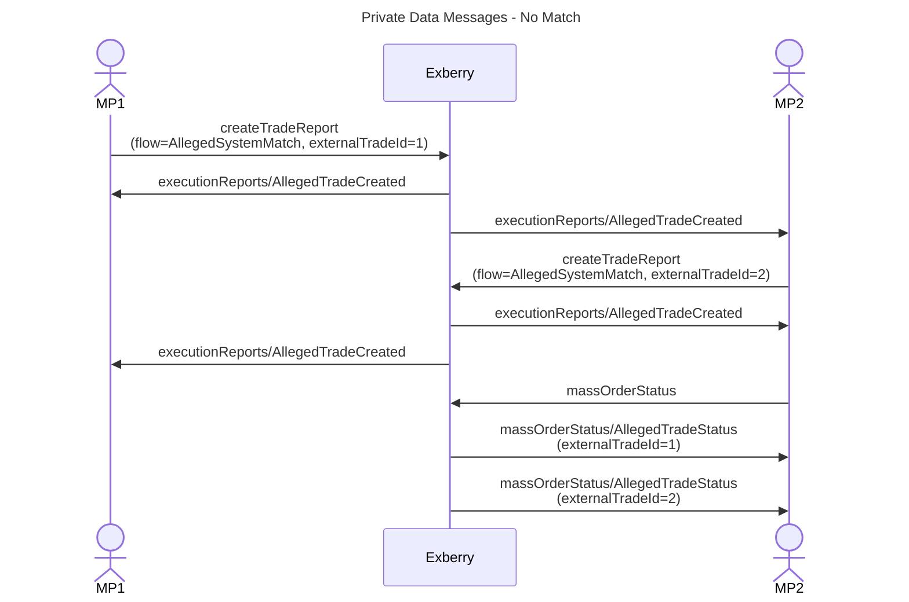
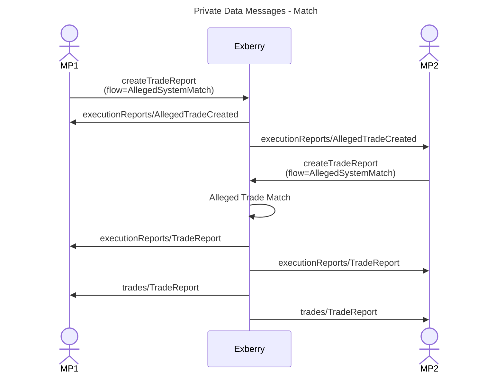

# Private Data

Refer [here](../../ws/private-data-api.md) for more details on Private Data APIs.


Private data messages allows to get real time updates on alleged trade reported as well as querying for any active alleged trade pending to be matched.&#x20;





## massOrderStatus

Market participant of both sides can use the `massOrderStatus` API to retrieve the current status of all active Alleged Trades.


qualifier: `v1/exchange.market/massOrderStatus`



### **Response**

`AllegedTradeStatus` response provides close to real time list of all current active Alleged Trades with the entire details.\
\
Note: There are no request parameters.

**AllegedTradeStatus message**

<table><thead><tr><th width="234">Field</th><th>Description</th></tr></thead><tbody><tr><td>messageType</td><td><strong>AllegedTradeStatus</strong></td></tr><tr><td>side</td><td>Similar to <a href="../../ws/reporting-api.md#response-2">Trades API</a></td></tr><tr><td>instrument</td><td>Similar to <a href="../../ws/reporting-api.md#response-2">Trades API</a></td></tr><tr><td>quantity</td><td>Similar to <a href="../../ws/reporting-api.md#response-2">Trades API</a></td></tr><tr><td>price</td><td>Similar to <a href="../../ws/reporting-api.md#response-2">Trades API</a></td></tr><tr><td>mpId</td><td>MP Id</td></tr><tr><td>mpName</td><td>MP name</td></tr><tr><td>parties</td><td>parties of the trade for mpId side </td></tr><tr><td>accountType</td><td>accountType of the trade for mpId side</td></tr><tr><td>tradeType</td><td>Similar to <a href="../../ws/reporting-api.md#response-2">Trades API</a></td></tr><tr><td>flow</td><td>Similar to <a href="reporting.md#response">Alleged Trades API</a></td></tr><tr><td>counterMpId</td><td>Counterparty mpId</td></tr><tr><td>counterMpName</td><td>Counterparty mpName</td></tr><tr><td>externalTradeId</td><td>Similar to <a href="reporting.md#response">Alleged Trades API</a></td></tr><tr><td>allegedTradeId</td><td>Similar to <a href="reporting.md#response">Alleged Trades API</a></td></tr><tr><td>expireTime</td><td>Similar to <a href="reporting.md#response">Alleged Trades API</a><br>Format: epoch time in seconds</td></tr><tr><td>createdTimestamp</td><td>Similar to <a href="reporting.md#response">Alleged Trades API</a><br>Format: epoch time in nanoseconds</td></tr><tr><td>lastEventTimestamp</td><td>Similar to <a href="reporting.md#response">Alleged Trades API</a><br>Format: epoch time in nanoseconds</td></tr><tr><td>lastEventId</td><td>Similar to <a href="reporting.md#response">Alleged Trades API</a></td></tr><tr><td>status</td><td>Active = alleged trade can be matched with another alleged trade</td></tr></tbody></table>

### **Error Codes**

Refer [here](../../ws/private-data-api.md#error-codes) for the error codes.


### **Samples**



```javascript
{
  "q": "v1/exchange.market/massOrderStatus",
  "sid": 100,
  "d": {}
}
```



```json
{
  "q": "v1/exchange.market/massOrderStatus",
  "sid": 14,
  "d": {
    "messageType": "AllegedTradeStatus",
    "side": "Buy",
    "instrument": "BBB",
    "quantity": 2,
    "price": 100.95,
    "accountType": "Client",
    "parties": [
      {
        "id": "123",
        "source": "D",
        "role": 38
      }
    ],
    "lastEventTimestamp": 1718277020415957800,
    "lastEventId": 6,
    "tradeType": "Block",
    "mpId": 14,
    "mpName": "JPM-1",
    "status": "Active",
    "flow": "AllegedSystemMatch",
    "counterMpId": 19,
    "counterMpName": "JPM-2",
    "externalTradeId": 10000002,
    "allegedTradeId": 2,
    "createdTimestamp": 1718277020415957800
  }
}
```



```javascript
{
  "q": "v1/exchange.market/massOrderStatus",
  "sid": 102,
  "d": {
    "lastTrackingNumber": 34256480
  }
}
```




## **executionReports**

Market participant of both sides can use the `executionReports`API to subscribe to events of Alleged Trades.

There are few message types used in this API:

* **AllegedTradeCreated**
* **AllegedTradeCancelled**


qualifier: `v1/exchange.market/executionReports`


### **Request** <a href="#request" id="request"></a>

<table><thead><tr><th width="180">Parameter</th><th width="110.33333333333331">Type</th><th>Description</th></tr></thead><tbody><tr><td>trackingNumber <code>optional</code></td><td>Long</td><td><p>Determines the starting point of stream. </p><p>• When set to 0 - Stream will start from first event ever</p><p>• When empty - Stream will start from the next upcoming event</p><p>• When set to specific <code>trackingNumber</code>- Stream will start from the next event after the given <code>trackingNumber</code></p></td></tr></tbody></table>

### **Response** <a href="#response-1" id="response-1"></a>

<table><thead><tr><th width="155.33333333333331">Message Type</th><th width="218">Field</th><th>Description</th></tr></thead><tbody><tr><td>All</td><td>messageType</td><td><p>One of the below values:</p><ul><li><strong>AllegedTradeCreated</strong></li><li><strong>AllegedTradeCancelled</strong></li></ul></td></tr><tr><td>All</td><td>side</td><td>Similar to <a href="../../ws/reporting-api.md#response-2">Trades API</a></td></tr><tr><td>All</td><td>instrument</td><td>Similar to <a href="../../ws/reporting-api.md#response-2">Trades API</a></td></tr><tr><td>All</td><td>quantity</td><td>Similar to <a href="../../ws/reporting-api.md#response-2">Trades API</a></td></tr><tr><td>All</td><td>price</td><td>Similar to <a href="../../ws/reporting-api.md#response-2">Trades API</a></td></tr><tr><td>All</td><td>mpId</td><td>MP Id</td></tr><tr><td>All</td><td>mpName</td><td>MP name </td></tr><tr><td>All</td><td>accountType</td><td>accountType for mpId side</td></tr><tr><td>All</td><td>parties</td><td>parties for mpId side</td></tr><tr><td>All</td><td>eventId</td><td>Similar to <a href="../../ws/reporting-api.md#response-2">Trades API</a></td></tr><tr><td>All</td><td>eventTimestamp</td><td>Similar to <a href="../../ws/reporting-api.md#response-2">Trades API</a></td></tr><tr><td>All</td><td>trackingNumber</td><td>Similar to <a href="../../ws/reporting-api.md#response-2">Trades API</a></td></tr><tr><td>All</td><td>flow</td><td>Similar to <a href="reporting.md#response">Alleged Trades API</a></td></tr><tr><td>All</td><td>counterMpId</td><td>Counterparty mpId</td></tr><tr><td>All</td><td>counterMpName</td><td>Counterparty mpName</td></tr><tr><td>All</td><td>externalTradeId</td><td>Similar to <a href="reporting.md#response">Alleged Trades API</a></td></tr><tr><td>All</td><td>allegedTradeId</td><td>Similar to <a href="reporting.md#response">Alleged Trades API</a></td></tr><tr><td>All</td><td>expireTime</td><td>Similar to <a href="reporting.md#response">Alleged Trades API</a><br>Format: epoch time in seconds</td></tr><tr><td>AllegedTradeCancelled</td><td>cancelReason</td><td>Similar to <a href="reporting.md#response">Alleged Trades API</a></td></tr></tbody></table>

### **Alleged Trade Messages Samples**



```javascript
{
  "q": "v1/exchange.market/executionReports",
  "sid": 13,
  "d": {
    "messageType": "AllegedTradeCreated",
    "side": "Buy",
    "instrument": "BBB",
    "quantity": 2,
    "price": 100.95,
    "accountType": "Client",
    "parties": [
      {
        "id": "123",
        "source": "D",
        "role": 38
      }
    ],
    "eventTimestamp": 1718277020415957800,
    "eventId": 6,
    "tradeType": "Block",
    "trackingNumber": 1901196000,
    "mpId": 14,
    "mpName": "JPM-1",
    "flow": "AllegedSystemMatch",
    "counterMpId": 19,
    "counterMpName": "JPM-2",
    "externalTradeId": 10000002,
    "allegedTradeId": 2
  }
}
```



```json
{
  "q": "v1/exchange.market/executionReports",
  "sid": 13,
  "d": {
    "messageType": "AllegedTradeCancelled",
    "side": "Buy",
    "instrument": "BBB",
    "quantity": 2,
    "price": 100.95,
    "accountType": "Client",
    "parties": [
      {
        "id": "123",
        "source": "D",
        "role": 38
      }
    ],
    "eventTimestamp": 1718303400000570400,
    "eventId": 9,
    "tradeType": "Block",
    "trackingNumber": 1901868896,
    "mpId": 14,
    "mpName": "JPM-1",
    "cancelReason": "Expiration",
    "flow": "AllegedSystemMatch",
    "counterMpId": 19,
    "counterMpName": "JPM-2",
    "externalTradeId": 10000002,
    "allegedTradeId": 2
  }
}
```



## trades

Refer [here](../../ws/private-data-api.md#trades) for more details on Trades API

`TradeReport` messages are disseminated with below changes.

### **Request**

<table><thead><tr><th width="170.33333333333331">Parameter</th><th width="84">Type</th><th width="483.66666666666674">Description</th></tr></thead><tbody><tr><td>trackingNumber <code>optional</code></td><td>Long</td><td><p>Determines the starting point of stream.<br>• When set to 0 - Stream will start from first event ever</p><p>• When empty - Stream will start from the next upcoming event</p><p>• When set to specific <code>trackingNumber</code>- Stream will start from the next event after the given <code>trackingNumber</code></p></td></tr></tbody></table>


### **Response**

<table><thead><tr><th width="149">Field</th><th width="444">Description</th><th width="125" align="center">Trade Entry</th></tr></thead><tbody><tr><td>orderId</td><td><p>For <strong>TradeReport</strong> of AllegedSystemMatch: </p><ul><li>value=allegedTradeId  </li></ul></td><td align="center">V</td></tr><tr><td>mpOrderId</td><td><p>For <strong>TradeReport</strong> if externalTradeId exist:</p><ul><li>value=externalTradeId</li></ul></td><td align="center">V</td></tr></tbody></table>

Other fields are similar to [Trades API](../../ws/private-data-api.md#trades)&#x20;

### **Error Codes**

Refer [here](../../ws/private-data-api.md#error-codes-2) for the error codes

