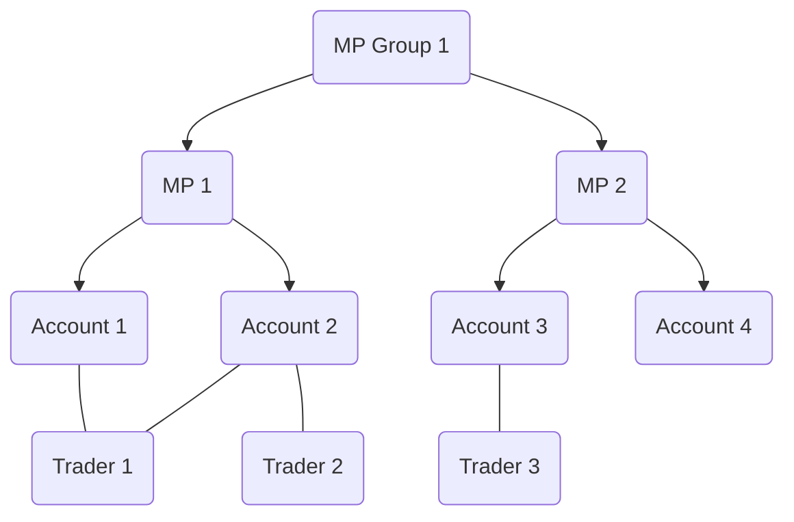

# Authentication

## Participants Structure&#x20;

The Exberry trading system models several core entities that define how participants interact with the exchange. These entities represent different operational and organizational levels, from firms to individual traders.

#### Market Participant (MP)

A Market Participant (MP) represents a trading or clearing firm that has access to the exchange.

* MPs are authorized entities able to submit trading commands (such as order entry, modification, and cancellation) directly to the exchange.
* Connection is established via API or through trading applications integrated with Exberry.
* Each MP operates under its own identification and permissions scope.

#### Account

An Account is a lower-level entity that always belongs to a single MP.

* Accounts can be used to separate activity within an MP — for example, by desk, client, or strategy.
* Use of accounts is optional, but when enabled, they provide a finer level of tracking and control (e.g., margin, position, or risk per account).
* If the ledger functionality is disabled, accounts are not mandatory.

#### Trader

A Trader represents an individual person (user) who logs in to a trading interface or application.

* Each trader is associated with one or more accounts.
* A trader can place and manage orders on behalf of the MP and within the scope of the accounts assigned to them.

#### MP Group

An MP Group is an optional grouping mechanism that combines multiple Market Participants under a single structure.

* Commonly used when a clearing firm supervises multiple trading members, or when firms require consolidated data across several MPs.
* Access and management of MP groups can be done via API.
* This feature enables aggregated views across related participants.\


#### Additional Order-Level Parties

Beyond the core entities, the system supports defining additional parties or attributes on an order-by-order basis.

* These may represent desks, clients, algorithms, or other internal classifications.
* Such fields can be configured as mandatory or optional, depending on exchange policy or integration requirements.
* This flexibility allows exchanges and firms to implement their own internal or regulatory reporting structures.



## createSession

The `createSession` API authenticates a user or participant to the exchange.\
Before making any other API calls, you must first create a valid session.\
A session remains active as long as the WebSocket connection stays open.\
Each WebSocket connection can have only one active session at a time.

***

**MP / MP Group Authentication**

Market Participants (MP) or MP Groups connecting to the exchange are provided with one or more pairs of `apiKey` and `secret`.\
Each `apiKey` is assigned specific permissions.\
To authenticate, a **digital signature** should be generated using the provided credentials, as described in the section below.

***

**Trader Authentication**

Trader access to the system can be established in one of two ways:

1. **Via UI (Auth0 Integration)**\
   The trader logs in using the embedded Auth0 form within the application.\
   Upon successful login, an **access token** is returned.\
   This token can then be used to create a session.
2. **Via API Credentials**\
   For direct API access, a session can be created using the trader’s **username** and **password**.



qualifier: exchange.market/createSession


### **apiKey Request**

<table><thead><tr><th width="121.33333333333331">Parameter</th><th width="144">Type</th><th>Description</th></tr></thead><tbody><tr><td>apiKey</td><td>String</td><td>Unique market participant API key provided by exchange operator</td></tr><tr><td>timestamp</td><td>Unix timestamp</td><td>Login timestamp in milliseconds, must be now in GMT</td></tr><tr><td>signature</td><td>String</td><td><p><code>HMAC SHA256 signature</code> computed using provided <code>secret</code> key and message body.<br>Example:</p><pre><code>Message = "apiKey":"1234567abcdz","timestamp":"1558941516123"
secret = MySecretKey
signature = 265cfbc40c22355d6c1ecc1f3a1e87e8c46954db9096a7bd6967241dd8bc65b6
</code></pre></td></tr></tbody></table>

How to compute the signature

```bash
echo -n '"apiKey":"1234567abcdz","timestamp":"1558941516123"' | openssl dgst -sha256 -hmac 'MySecretKey'
(stdin)= 265cfbc40c22355d6c1ecc1f3a1e87e8c46954db9096a7bd6967241dd8bc65b6
```

### **Trader Request - Auth0 Integration**

<table><thead><tr><th width="121.33333333333331">Parameter</th><th width="144">Type</th><th>Description</th></tr></thead><tbody><tr><td>token</td><td>String</td><td>Auth0 access token </td></tr></tbody></table>

### **Trader Request - Credentials**&#x20;

<table><thead><tr><th width="121.33333333333331">Parameter</th><th width="144">Type</th><th>Description</th></tr></thead><tbody><tr><td>username</td><td>String</td><td>Trader email</td></tr><tr><td>password</td><td>String</td><td>Trader password </td></tr></tbody></table>

### **Error Codes**

<table><thead><tr><th width="141">Code</th><th>Message</th></tr></thead><tbody><tr><td>6000</td><td><code>Authentication failed</code></td></tr><tr><td>6001</td><td><code>Wrong timestamp</code></td></tr><tr><td>6002</td><td><code>Missing fields: [Fieldname]</code></td></tr><tr><td>6003</td><td><code>Create session failed</code></td></tr></tbody></table>

### **Samples**



<pre class="language-json"><code class="lang-json"><strong>//apiKey Request 
</strong>{
  "q": "exchange.market/createSession",
  "sid": 15,
  "d": {
    "apiKey": "6ggg",
    "timestamp": "1563880778434",
    "signature": "1842286ea411ebdc3dde3e6b3185cc85c19fa0140d0eecebb0c74137e9957981"
  }
}
<strong>//Trader Credentials 
</strong>{
  "q": "exchange.market/createSession",
  "sid": 1,
  "d": {
    "username": "demo@exberry.io",
    "password": "4567Tg*(&#x26;g"
  }
}
</code></pre>



```json
{
    "q":"exchange.market/createSession",
    "sid":15,
    "d":{}
}
```



```json
{
  "sig": 2,
  "q": "exchange.market/createSession",
  "errorType": "401",
  "sid": 1,
  "d": {
    "errorCode": 6000,
    "errorMessage": "Authentication failed"
  }
}
```


